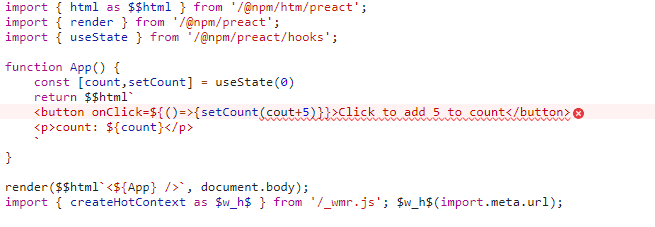

# Comparing the New Generation of Build Tools

A bunch of new developer tools have landed in the past year and they are biting at the heels of the tools that have dominated front-end development over the last few years, including webpack, Babel, Rollup, Parcel, create-react-app.

These new tools aren’t designed to perform the exact same function, and each has different things they’re trying to achieve and features to get there. Despite their differences, these tools do share a common goal: **improve the developer experience.**


> #### Table of contents
>
> 1. [esbuild](#esbuild)
> 2. [Snowpack](#snowpack)
> 3. [Vite](#vite)
> 4. [wmr](#wmr)
> 5. [Feature comparison](#feature-comparison)
> 6. [Wrapping up](#wrapping-up)

* * *

Specifically, I’d like to evaluate each one, outlining what they do, why we need them, and their use cases. I realize that comparisons aren’t always fair. Again, it’s not like any of the things we’re looking at in this article are direct competitors. In fact, Snowpack and Vite actually _use_ esbuild under the hood for certain tasks. Our goal is more to get a better view of the landscape of developer tools that run tasks to make our jobs easier. This way, we see what options are out there and how they stack up, so we can make the best choices when we need them.

Of course, all of this will be colored by my experience using React and Preact. I’m more familiar with these ~frameworks~ libraries, but we’ll look at their support for other front-end frameworks too.

There have been a whole lot of great articles, streams and podcasts about these new developer tools. There are a couple of ShopTalk Show episodes I’d recommend for more context: [Episode 454](https://shoptalkshow.com/454/) discusses Vite and [Episode 448](https://shoptalkshow.com/448/) features the creators of wmr and Snowpack. Something that stands out from these episodes is that a huge amount of work has gone into building these tools to modernize our developer environments.

### [](#why-are-these-tools-all-arriving-now)Why are these tools all arriving now?

In part, I think these tools are arriving as a reaction to JavaScript tooling fatigue — something captured nicely in [this article about learning JavaScript back in 2016](https://hackernoon.com/how-it-feels-to-learn-javascript-in-2016-d3a717dd577f). They also fill a missing middle ground between writing a single vanilla JavaScript file, and having to download 200 megabytes of tooling dependencies before you’ve written a line of your own code. They come batteries-included without the dependency list, and are part of a trend of [collapsing layers](https://www.swyx.io/js-third-age/) in the JavaScript ecosystem.

Snowpack, Vite, and wmr have all been enabled by [native JavaScript modules](https://css-tricks.com/life-with-esm/) in the browser. Back in 2018, [Firefox 60 was released](https://developer.mozilla.org/en-US/docs/Mozilla/Firefox/Releases/60#javascript) with ECMAScript 2015 modules enabled by default. Since then, all major browser engines have supported native JavaScript modules. Node.js also shipped with [native JavaScript modules](https://github.com/nodejs/node/blob/master/doc/changelogs/CHANGELOG_V13.md#13.2.0) in November 2019. We’re still finding out what possibilities native JavaScript modules unlock today in 2021.

### [](#how-are-these-different-from-existing-tools)How are these different from existing tools?

Whether we use webpack, Rollup, or Parcel for a development server, the tool bundles our entire codebase from our source code and a `node_modules` folder, runs these through build processes —  like Babel, TypeScript, or PostCSS — then pushes the bundled code to our browser. This all takes work, and can slow development servers to a crawl in larger codebases, even after all the work that’s gone into caching and optimizing.

Snowpack, Vite, and wmr development servers don’t follow this model. Instead, they wait until the browser finds an import statement and makes an HTTP request for the module. Only after this request is made will the tool apply transforms to the requested module and any leaf nodes in the module’s import tree, then serve these to the browser. This speeds things up a lot as there’s less work in the process of pushing to a dev server.

You’ll notice [esbuild](https://esbuild.github.io/) missing from this picture. It’s a _bundler_ first and foremost. It doesn’t side-step bundling the way the other tools do. Instead, esbuild processes code [extremely fast](https://esbuild.github.io/faq/#benchmark-details) by [avoiding expensive transformations, leveraging parallelization and using the Go language](https://esbuild.github.io/faq/#why-is-esbuild-fast).

### [](#the-experiment)The experiment

I took one of the the example apps from the React docs and rebuilt it with each tool covered in this article. The project I went with was [Snap Shot](https://github.com/Yog9/SnapShot) by [Yogita Verma](https://yog9.github.io/portfolio/). Here’s a [link to the original repo](https://github.com/Yog9/SnapShot), and a [link to my repo with the four versions of Snap Shot](https://github.com/Elliotclyde/build-tool-test), each using a different build tool. We’ll compare the output of each build step later. Rebuilding this app allowed me to test out the developer experience of pulling some pretty standard React dependencies into the tools, including [React Router](https://reactrouter.com/) and [a](https://github.com/axios/axios)[xios](https://github.com/axios/axios).

### [](#comparable-features)Comparable features

Before we get into the specifics of each individual tool, they _all_ support the following features out of the box (to varying degrees):

*   First-class support for native JavaScript modules
*   TypeScript compilation (but not type checking)
*   JSX
*   Plugin API for extensibility
*   A built-in development server
*   CSS bundling and support for CSS-in-JS libraries

All of these tools can compile TypeScript into JavaScript, but will do so _even if there are type errors_. For proper type checking you would need to install TypeScript and run `tsc --noEmit` on your root JavaScript file, or alternatively, use editor plugins to watch for type errors.

OK, let’s take look at each tool.

### [](#esbuild)esbuild


esbuild was created by [Evan Wallace](https://github.com/evanw) (CTO of [Figma](https://www.figma.com/)). Its main feature is that it provides a build step 10×-100× faster than Node-based bundlers (by their own benchmarks). It doesn’t provide many of the developer conveniences you might find in something like create-react-app. But there are more and more esbuild starters popping up that fills those gaps, including [create-react-app-esbuild](https://github.com/pradel/create-react-app-esbuild), [estrella](https://github.com/rsms/estrella) and [Snowpack](https://www.snowpack.dev/), which uses esbuild for its build step.

esbuild is very new. It hasn’t yet reached a 1.0 version and isn’t quite ready for production use — but it’s not far off. It gives you intuitive JavaScript and command line APIs with smart defaults.

#### [](#use-cases)Use cases

esbuild is a complete game-changer in the bundler world. It’s going to be most useful in large codebases where the speed difference between esbuild and node bundlers gets multiplied. When esbuild hits 1.0 it’s going to be _very_ useful in big production sites, and will save teams a whole lot of time waiting for builds to complete. Unfortunately, big production sites will have to wait until esbuild becomes stable. In the meantime it’ll just be good to add some speed to your bundling in side projects.

esbuild’s lightening fast speed will be a bonus for any kind of work that you’re doing. Less time spent waiting for builds to run is always going to be good for developer experience! This considered, if you’re prototyping quick applications you might want to start with something more high level than esbuild — otherwise, you’ll need to spend some time pulling in dependencies and configuring your environment before you get conveniences we expect in the JavaScript ecosystem. Also, if you want to minimize the size of your bundle as much as possible you may want to use Rollup and terser, which will produce slightly smaller bundle sizes.

#### [](#setup)Setup

I decided to start a React project in esbuild in a naïve way: npm installing esbuild, React and ReactDOM. I created a `src/app.jsx` file and a `dist/index.html` file. Then, I used the following command to compile the app into a `dist/bundle.js` file:

```shell
./node_modules/.bin/esbuild src/app.jsx --bundle --platform=browser --outfile=dist/bundle.js
```

When I hosted and opened `index.html` in the browser, I was met with the “white screen of death” and an “Uncaught ReferenceError: process is not defined” console error. [Both the docs and the CLI explain exactly what you need to do to prevent this](https://esbuild.github.io/getting-started/#bundling-for-the-browser) but it might be a bit of a “gotcha” for beginners, because it requires an extra argument when bundling React:

```shell
--define:process.env.NODE_ENV=\"production\"
```

Or, if you’re including esbuild in npm scripts written like this to escape the quotes:

```shell
--define:process.env.NODE_ENV=\\\"production\\\"
```

This `define` argument is needed for any library bundled for the browser that expects node environment variables. Vue 2.0 also expects these. You won’t have the same problem with Preact because it doesn’t expect any environment variables and ships ready for the browser by default.

After I ran the command with the `define` argument, my “Hello world” React app was working perfectly. JSX works out of the box with `.jsx` files. That said, React needs to be manually imported and then JSX is converted to the `React.createElement`. However, there are ways to add [auto imports in JSX and/or configure JSX for](https://esbuild.github.io/content-types/#jsx) [P](https://esbuild.github.io/content-types/#jsx)[react](https://esbuild.github.io/content-types/#jsx).

#### [](#usage)Usage

esbuild provides a `--serve` option for a development server. This bypasses the filesystem and serves modules straight from memory, ensuring that the browser doesn’t pull older versions of modules. However, it doesn’t include live/hot reloading, so you will find yourself refreshing the browser after saving which isn’t an ideal experience.

I decided to use the newly-released [**watch**](https://esbuild.github.io/api/#watch) [feature](https://esbuild.github.io/api/#watch).This tells esbuild to recompile code every time a source file is saved. But we still need a server to see our saved changes. We can pull in a development server package, such as Luke Jackson’s [servor](https://www.npmjs.com/package/servor):

```shell
npm install servor --save-dev
```

Then we can use the esbuild Javascript API to start as server and run esbuild’s watch mode at the same time. Let’s create a file at the root of our project called `watch.js`:

```javascript
// watch.js
const esbuild = require("esbuild");
const servor = require("servor");

esbuild.build({
  // pass any options to esbuild here...
  entryPoints: ["src/app.jsx"],
  outdir: "dist",
  define: { "process.env.NODE_ENV": '"production"' },
  watch: true,
});

async function serve(){
  console.log("running server from: http://localhost:8080/");
  await servor({
    // pass any options to servor here...
    browser:true,
    root: "dist",
    port: 8080,
  });
}

serve();
```

Now run `node watch.js` in the command line. This gives us a nice dev server, though again, it doesn’t give us hot module replacement or fast refresh (i.e., your client-side state won’t be preserved). But this was enough for my testing needs.

Even though we’re rebundling our entire application every time we save a file, we’d need to have a pretty massive application before esbuild slows down. After I set up this tooling, I was getting instant feedback from changes. My computer uses an intel i7 from 2012, so it certainly isn’t a top-of-the-line machine.

If you need a preconfigured version of esbuild with live reload and some React defaults, you can clone [this repo](https://github.com/Elliotclyde/esbuild-react-starter).

#### [](#supported-files)Supported files

esbuild can import CSS in JavaScript if that’s your style. It will compile CSS into an output file with the same name as your main output JavaScript file. It can also bundle CSS `@import` statements by default. There is no support for [CSS Modules](https://css-tricks.com/css-modules-part-1-need/), but there are plans for it.

There is a [growing community of plugins for esbuild](https://github.com/esbuild/community-plugins). For example, there are plugins available for [Vue single file components](https://github.com/few-far/esbuild-vue-plugin), and [Svelte components](https://github.com/EMH333/esbuild-svelte).

esbuild works with JSON files and can bundle them into JavaScript modules without any configuration.

It can also import images in JavaScript with the option to either convert them into data URLs or copying them into an output folder. This behavior isn’t enabled by default, but you can add the following in your esbuild config object to enable either option:

```javascript
loader: { '.png': 'dataurl' } // Converts to data url in JS bundle
loader: { '.png': 'file' } // Copies to output folder
```

Code splitting appears to be a work in progress, but is mostly there in the ESM output format, and it does look like it is a priority for the project. It’s also worth mentioning that tree-shaking is built into esbuild by default and can’t be turned off.

#### [](#production-build)Production build

Using the “[minify](https://esbuild.github.io/api/#minify)” and “[bundle](https://esbuild.github.io/api/#bundle)” options in your esbuild command won’t create a bundle quite as small as a [Rollup](https://rollupjs.org/)/[Terser](https://terser.org/) pipeline. This is because esbuild sacrifices some bundle size optimization to get through your code in as few passes as possible. However, the difference may be pretty negligible, and worth it for the increase in bundling speed, depending on your project. In my clone of the Snap Shot application, esbuild created a bundle of 177 KB which isn’t a lot more than the 165KB produced by Vite, which uses rollup and terser.

#### [](#overall)Overall

<table><thead><tr><th><strong>esbuild</strong></th><th></th></tr></thead><tbody><tr><td>Templates for multiple front end frameworks</td><td>❌</td></tr><tr><td>Hot&nbsp;module&nbsp;replacement development server</td><td>❌</td></tr><tr><td>Streaming&nbsp;imports</td><td>❌</td></tr><tr><td>Preconfigured&nbsp;production&nbsp;build&nbsp;</td><td>❌</td></tr><tr><td>Automatic&nbsp;PostCSS and preprocessor conversion</td><td>❌</td></tr><tr><td>HTM transform</td><td>❌</td></tr><tr><td>Rollup plugin support</td><td>❌</td></tr><tr><td>Size on disk&nbsp;(default&nbsp;install)</td><td>7.34 MB</td></tr></tbody></table>

esbuild is an extremely powerful tool. But it might be difficult if you’re used to zero-config setups. If you need more, then you might want to take a look at the next tool, Snowpack, which uses esbuild.

### [](#snowpack)Snowpack


Snowpack is a build tool by the creators of [Skypack](https://www.skypack.dev/) and [Pika](https://www.pika.dev/). It provides an awesome development server and was created with an [“unbundled development”](https://www.snowpack.dev/concepts/how-snowpack-works#unbundled-development) philosophy. To quote the documentation: “You should be able to use a bundler because you want to, and not because you need to.”

By default, Snowpack’s build step doesn’t bundle files into a single package but provides unbundled esmodules that run in the browser. esbuild is actually included in there as a dependency, but the idea is to use JavaScript modules and only bundle with esbuild when it’s needed.

Snowpack has some [pretty slick documentation](https://www.snowpack.dev/), including a [list of guides](https://www.snowpack.dev/guides) for using it with JavaScript frameworks, and a [bunch of templates for them](https://github.com/snowpackjs/snowpack/tree/main/create-snowpack-app). Some of the guides are still a work in progress, but others like [the one for React](https://www.snowpack.dev/tutorials/react) are nice and clear. It also looks like Snowpack treats [Svelte as a first-class citizen](https://www.snowpack.dev/tutorials/svelte/). I actually first heard about Snowpack from Rich Harris’s [“Futuristic Web Development”](https://www.youtube.com/watch?v=qSfdtmcZ4d0&t=636s) talk at Svelte Summit 2020. That said, the upcoming Svelte meta-framework [SvelteKit](https://svelte.dev/blog/whats-the-deal-with-sveltekit) was supposed to be powered by Snowpack but has since switched to Vite (which we’ll review next).

#### [](#use-cases)Use cases

Snowpack is a good choice if you want to double down on unbundled deployment. You may be writing source code with a small number of modules. This would mean you’re not creating a big request waterfall with an unbundled build. If you don’t need the added complexity and technical debt of bundling, then Snowpack is a great choice. A good use case would be if you’re incrementally adopting a front-end framework into a server-rendered or static application. You’d be pulling in as little tooling as possible from the node ecosystem but you’d still be getting the benefits of declarative frontend frameworks.

Secondly, I’d argue that Snowpack is a great wrapper around esbuild. If you want to try out esbuild but also want a development server and pre-written templates for front-end frameworks, then you can’t go wrong with Snowpack. Enable esbuild in the build step of your Snowpack config and you’re good to go.

As things currently stand, I’d argue that Snowpack wouldn’t be the best replacement for a zero configuration tool like create-react-app because you’ll need to pull in plugins and configure them yourself if you have a big application and need a super-fancy optimized production-ready build step.

#### [](#setup)Setup

Let’s start a project with Snowpack by jumping into the command line:

```shell
mkdir snowpackproject
cd snowpackproject
npm init #fill with defaults 
npm install snowpack
```

Now, let’s add the following to `package.json`:

```javascript
// package.json
"scripts": {
  "start": "snowpack dev",
  "build": "snowpack build"
},
```

Next, we’ll create a configuration file:

```shell
// Mac or Linux
touch snowpack.config.js
// Windows
new-item snowpack.config.js
```

I think the most magical part of Snowpack comes when setting one innocent-looking key value pair in the configuration file. Paste this into the configuration file, for example:

```javascript
// snowpack.config.js
module.exports = {
  packageOptions: {
    "source": "remote",
  }
};
```

`source: remote` enables something called [**streaming imports**](https://www.snowpack.dev/guides/streaming-imports#how-streaming-imports-work). Streaming imports enable Snowpack to bypass npm installation by converting bare imports (e.g., `import React from 'react';`) into CDN imports from Skypack.

Moving ahead, let’s make an `index.html` file:

```index.html
<!--index.html-->
<!DOCTYPE html>
<html lang="en">
<head>
  <meta charset="UTF-8">>
  <title>Snowpack streaming imports</title>
</head>
<body>
  <div id="root"></div>
  <!-- Note the type="module". This is important for JavaScript module imports. -->
  <script type="module" src="app.js"></script>
</body>
</html>
```

And, finally, we’ll add an `app.jsx` file:

```jsx
// app.jsx
import React from 'react'
import ReactDOM from 'react-dom'
const App = ()=>{
  return <h1>Welcome to Snowpack streaming imports!</h1>
}
ReactDOM.render(<App />,document.getElementById('root')); 0
```

Note that we didn’t npm install React or ReactDOM at any stage. But if we start up the Snowpack developer server like this:

```shell
./node_modules/.bin/snowpack dev
```

…our app still works!

Instead of pulling from a `node_modules` folder, Snowpack pulls the npm package down from Skypack, a CDN that hosts the npm registry, and it’s is pre-optimized to work in the browser. Snowpack then serves it in a `./_snowpack/pkg` URL.

#### [](#usage)Usage

This is a big step away from Node/npm-based workflow. What we’re actually looking at is a new **CDN/JavaScript module-based workflow.**

If, however, we our app as it is and run a production build, Snowpack throws an error. This is because it needs to know which versions of React and ReactDOM to use when building. You can fix this by writing to a `snowpack.deps.json` which can automatically be created by running the following:

```shell
./node_modules/.bin/snowpack add react
./node_modules/.bin/snowpack add react-dom
```

That won’t download the package from npm, but it will record the version of the packages used for Snowpack builds.

One caveat is that we miss out on developer error messages, as Skypack will ship the production version of packages.

Even if we aren’t using streaming imports, the Snowpack development server bundles each dependency from `node_modules` into one JavaScript file per dependency, converts those files to a native JavaScript module, then serves it to the browser. This means the browser can cache these scripts and only re-request them if they’ve changed. The development server automatically refreshes on save, but doesn’t preserve the client-side state. All dependencies from node seemed to work out of the box regardless of whether they were using legacy module formats or node APIs (such as the infamous `process.env` we had trouble with in esbuild).

Preserving client-side state in React requires [react-refresh](https://www.skypack.dev/view/@snowpack/plugin-react-refresh), which requires a few Babel packages of its own as dependencies. These aren’t included by default, but are available using the more maximal React template. The template pulls in react-refresh, Prettier, Chai, and React Testing Library, for a total Node dependency package weighing in at 80 MB:

```shell
npx create-snowpack-app my-react-project --template @snowpack/app-template-react
```

#### [](#supported-files)Supported files

JSX is supported, but again, only with `.jsx` files by default. Snowpack automatically detects if whether React or Preact is being used, and decides accordingly which render function to use for the JSX transform. However, if we want to customize the JSX further than this, we’d need to pull in Babel via [their plugin](https://www.npmjs.com/package/@snowpack/plugin-babel). There is also a [Snowpack plugin available for Vue single file components](https://www.npmjs.com/package/@snowpack/plugin-vue) and, of course, for [Svelte components](https://github.com/snowpackjs/snowpack/tree/main/plugins/plugin-svelte). Further, Snowpack compiles TypeScript, but for type checking we need the [TypeScript plugin](https://www.npmjs.com/package/@snowpack/plugin-typescript).

CSS can be imported into JavaScript and are tossed into the document `<head>` at runtime. CSS modules are also supported out of the box for scoping as long as they have the `.module.css` extension.

Imported JSON files will be cast into a JavaScript module with an object as a default export. Snowpack supports images and copies them into the production folder. Going along with its unbundled philosophy, Snowpack does not include images as data URLs in the bundle.

#### [](#production-build)Production build

The default `snowpack build` command basically copies the exact source file structure into an output folder. For files that compile to JavaScript (e.g. TypeScript, JSX, JSON, `.vue`, `.svelte`), it transforms each individual file into a separate browser-friendly JavaScript module.

This works fine, but isn’t great for production, as it could cause a big waterfall of requests if the source code is split into a lot of files. In the Snap Shot application I ended up with 184KB of source files which would then request another 105 KB of dependencies from Skypack which made for a pretty huge waterfall.

However, Snowpack pulls esbuild as a dependency and we can enable esbuild to bundle, minify and compile our code by adding an “optimize” object to the Snowpack config:

```javascript
// snowpack.config.js
module.exports = {
  optimize: {
    bundle: true,
    minify: true,
    target: 'es2018',
  },
};
```

This runs the code using the optimization features provided by esbuild, so by just adding these options we could get the same build we had earlier on with esbuild.

Since esbuild hasn’t reached 1.0 yet, Snowpack recommends using either the [webpack](https://www.npmjs.com/package/@snowpack/plugin-webpack) or [Rollup](https://github.com/ParamagicDev/snowpack-plugin-rollup-bundle) plugin for production builds, both of which need to be configured.

#### [](#overall)Overall

Snowpack provides a lightweight developer experience with a full-featured development server, detailed documentation, and easy-to-install templates. You are left to decide whether you want to bundle your application and how you want to do so. If you want a tool that provides both a dev server and a more opinionated build step, you might want to take a look at Vite, the next tool on our list.

<table><thead><tr><th><strong>Snowpack</strong></th><th></th></tr></thead><tbody><tr><td>Templates for multiple front end frameworks</td><td>✅</td></tr><tr><td>Hot&nbsp;module&nbsp;replacement development server</td><td>✅ (when&nbsp;using templates)</td></tr><tr><td>Streaming&nbsp;imports</td><td>✅</td></tr><tr><td>Preconfigured&nbsp;production&nbsp;build&nbsp;</td><td>❌</td></tr><tr><td>Automatic&nbsp;PostCSS and preprocessor conversion</td><td>❌</td></tr><tr><td>HTM transform</td><td>❌</td></tr><tr><td>Rollup plugin support</td><td>✅&nbsp;(when&nbsp;using&nbsp;<a target="_blank" href="https://github.com/ParamagicDev/snowpack-plugin-rollup-bundle" rel="noreferrer noopener">snowpack-plugin-rollup-bundle</a>&nbsp;for build step)</td></tr><tr><td>Size on disk&nbsp;(default&nbsp;install)</td><td>16 MB</td></tr></tbody></table>

### [](#vite)Vite


Vite is developed by Vue creator (and [Hades speedrunner](https://mobile.twitter.com/youyuxi/status/1331084461652516864)) Evan You. Where esbuild concentrates on the build step and Snowpack concentrates on the development server, Vite provides both: a full development server _and_ an optimized build command using Rollup.

#### [](#use-cases)Use cases

If you want a serious create-react-app or Vue CLI competitor, Vite is the closest one in the bunch because it comes with batteries-included features. The lightening-fast development server and zero-config optimized production build mean you can get from zero to production without any configuration. Vite is a tool that could be used in both a tiny side-project or a big production application. A good use case for Vite would be any sizeable single page app.

Why _wouldn’t_ you use Vite? Vite is an opinionated tool and you might disagree with its opinions. You might not want to use Rollup for your build (we’ve been talking about how fast esbuild is), or you might want your tooling to give you the full power of Babel, eslint and the ecosystem of webpack loaders out of the box.

Also, you want zero-config server-side rendering meta-frameworks, you’d be better off staying with webpack-based frameworks, like Nuxt.js and Next.js until the story for Vite server-side rendering is more complete.

#### [](#setup)Setup

Vite has more opinionated defaults than esbuild and Snowpack. Its [documentation](https://vitejs.dev/) is clear and detailed. We get full support for Vue with Evan being the creator and all, so Vite is a definite happy path for Vue developers. That said, Vite can be used with any front-end framework and even provides a [list of templates](https://github.com/vitejs/vite/tree/main/packages/create-app) to get you started.

#### [](#usage)Usage

Vite’s development server is pretty powerful. Vite pre-bundles all of a project’s dependencies together into a single native JavaScript module with esbuild, then serves it up with a heavily cached HTTP header. This means no time is wasted on compiling, serving or requesting imported dependencies after the first page load. Vite also provides clear error messaging, printing the exact block of code and the line numbers to troubleshoot. Again with Vite, I didn’t have any issues pulling in dependencies that used node APIs or legacy formats. They all seemed to be shimmed into a browser-acceptable esmodule.

Vite’s React and Vue templates both pull in plugins that enable hot module replacement. The Vue template pulls in a [Vue plugin for single file components](https://github.com/vitejs/vite/tree/main/packages/plugin-vue), and a [Vue plugin for JSX](https://github.com/vitejs/vite/blob/main/packages/plugin-vue-jsx/package.json). The React template pulls in the [react-refresh plugin](https://github.com/vitejs/vite/tree/main/packages/plugin-react-refresh). Either way, both will give you hot module replacement and client-side state preservation. Sure, they add a few more dependencies, including Babel packages, but, Babel isn’t actually necessary when using JSX in Vite. By default, JSX works the same way as esbuild — it converts to `React.createElement`. It won’t automatically import React, but its behavior can be configured.

And while we’re at it, Vite doesn’t support streaming imports like Snowpack and wmr do. That means npm-installing dependencies as usual.

One cool thing is that Vite includes [experimental support](https://vitejs.dev/guide/ssr.html) for server-side rendering. Pick your framework of choice and generate static HTML that ships directly to the client. At the moment, it looks like we need to construct this architecture on our own, but still, this looks like a good opportunity for meta-frameworks to be built on top of Vite. Evan You already has a work in progress called [VitePress](https://vitepress.vuejs.org/), a replacement for [VuePress](https://vuepress.vuejs.org/) with the benefits of using Vite. And Sveltekit has also [added Vite to its dependency list](https://svelte.dev/blog/sveltekit-beta). It looks like [CSS code splitting](https://vitejs.dev/guide/features.html#css-code-splitting) inclusion was part of the reason Sveltekit made the switch to Vite.

#### [](#supported-files)Supported files

For CSS, Vite provides the most features out of all of the tools that we are looking at. It supports bundling CSS imports as well as CSS modules. But we can also `npm install` PostCSS plugins and create a `postcss.config.js` file, and Vite will automatically start applying these transforms to CSS.

We can install and use CSS preprocessors — simply `npm install` the preprocessor and rename the file to the right extension (e.g. `.filename.scss`) and Vite will start applying the corresponding preprocessor. And, as we said in the overview, Vite support CSS code-splitting.

Image imports default to a public URL, but we’re also able load them into the bundle as strings by using a `?raw` parameter at the end of the URL string.

JSON files can be imported in the source and converted into an esmodule exporting a single object. We can also provide a named import and Vite will look in the root field of the JSON file to find the import and treeshake the rest.

#### [](#production-build)Production build

Vite uses Rollup for a preconfigured production build with a bunch of optimizations. It intentionally provides a zero-config build which should be enough for most use cases.

The build comes with the Rollup features we expect: bundling, minification and tree shaking. But we also get extras, like code-splitting dynamic imports and something called “asynchronous chunk loading” which is a fancy way to say that if we request a JavaScript module that imports another module, the build will be pre-optimized to load both at the same time (asynchronously).

Running Vite’s default build with the Snap Shot app I ended up with one 5KB JavaScript file and one 160KB JavaScript file (for a grand total of 165KB) and all CSS in the project was automatically minified to a tiny 2.71KB file.

#### [](#overall)Overall

The opinionated nature of Vite makes it a serious competitor with our current tooling. A lot of work has been done to make the developer experience really seamless and make production-ready builds out of the box.

<table><thead><tr><th><strong>Vite</strong></th><th></th></tr></thead><tbody><tr><td>Templates for multiple front end frameworks</td><td>✅</td></tr><tr><td>Hot&nbsp;module&nbsp;replacement development server</td><td>✅ (when&nbsp;using templates)</td></tr><tr><td>Streaming&nbsp;imports</td><td>❌</td></tr><tr><td>Preconfigured&nbsp;production&nbsp;build&nbsp;</td><td>✅</td></tr><tr><td>Automatic&nbsp;PostCSS and preprocessor conversion</td><td>✅</td></tr><tr><td>HTM transform</td><td>❌</td></tr><tr><td>Rollup plugin support</td><td>✅&nbsp;</td></tr><tr><td>Size on disk&nbsp;(default&nbsp;install)</td><td>17.1 MB</td></tr></tbody></table>

### [](#wmr)wmr


Like Vite, wmr is another opinionated build tool that provides both a development server and a build step. It was built by the creator of [Preact](https://preactjs.com/), [Jason Miller](https://twitter.com/_developit), so it’s definitely a happy path for Preact developers. Jason Miller explained the thinking behind wmr when [he appeared as a guest on the JS Party podcast](https://changelog.com/jsparty/158):

> Preact is tiny and it’s really good if you want to do a lightweight project. Where is our tooling for that? We have a webpack-based tool that’s used in used in production by a bunch of high profile sites, but that’s the heavyweight tool. Where’s the prototyping tool? That was the one hand. The other hand is myself and a bunch of others who happened to be on the Preact team; We had been kind of on the sidelines of the bundler ecosystem for a little while, prodding people, trying to get consensus on a direction that we can move in to further this idea of writing modern code and shipping modern code.

This tells us that wmr is all about writing and shipping modern code, enabling lighter tooling in a project.

You might be wondering what wmr stands for? Nothing! The names “Web Modules Runtime” and “Wet Module Replacement” were floated, but it’s a fake abbreviation, similar to npm.

wmr is built with the same ruthless bundle size purging as Preact, so it’s tiny — weighing a mere 2.6 MB — and contains exactly zero npm dependencies. Still, it manages to pack in a whole lot of really awesome features including a hot-module-replacing development server and an optimized production build.

#### [](#use-cases)Use cases

I would use wmr if I was looking to create a prototype using Preact as fast as possible. There’s no configuration and it only takes seconds to download. It feels like using a supercharged static file server. With TypeScript, an optimized-build step, and static HTML rendering, wmr offers everything needed to ship small-to-medium sized applications. Its small size is also great for quickly trying out a library or demoing an idea.

wmr may not be the tool for you if you’re not using Preact, React or vanilla JavaScript. The Preact team has yet to provide templates for other frameworks. The documentation also isn’t as detailed as the other tools we’ve looked at. This means the further you stray from the happy path, the more you’ll dig into the source. So, I can’t recommend it if a lot of customization is needed.

#### [](#setup)Setup

If you’re using preact there is absolutely zero setup needed except for a quick npm install. To use React with wmr instead of Preact, there are currently two steps to take. First, alias `htm/preact` to `htm/react`, and `react` to `es-react` in your `package.json`:

```javascript
"alias": {
  "htm/preact": "htm/react",
  "react": "es-react"
},
```

Then add imports from `es-react` into your components:

```javascript
// ReactDOM only needed on root render
import { React, ReactDOM,} from 'es-react';
```

This means we aren’t actually using the normal React package you might be used to, but instead pulling in React from [es-react](https://github.com/lukejacksonn/es-react). This is because wmr relies on packages being compatible with native JavaScript modules. React does not use native modules by default, instead using an older style of module called [UMD modules](https://github.com/umdjs/umd). es-react is a package that pulls in React but provides exports that are compatible with the web platform.

This illustrates wmr’s philosophy of using native primitives of the web platform as opposed to using tooling to sidestep and abstract it away.

Another option could be to use Skypack imports in our application, which is also pre-optimized to work in the browser:

```javascript
import React from 'https://cdn.skypack.dev/react';
import ReactDOM from 'https://cdn.skypack.dev/react-dom';
```

wmr expects that you’re writing modern code which runs in the browser, which may mean that you’ll need to do some configuration if you pull in dependencies that use node APIs or legacy module systems. To get the Snap Shot app working I needed to dive into node modules and convert a library or two to use native JavaScript module syntax. This might slow you down if you are using older libraries. The Preact ecosystem is all optimized to run in the browser and shouldn’t require any massaging. This is another reason to stick with the Preact happy path in wmr.

There are plugins for wmr. It exposes a plugin API that supports Rollup plugins for a build step. There are more and more wmr-specific examples on the docs, including a plugin that [minifies](https://github.com/preactjs/wmr/wiki/Configuration-Recipes#minifying-html) [HTML](https://github.com/preactjs/wmr/wiki/Configuration-Recipes#minifying-html), and one that features [filesystem](https://github.com/preactjs/wmr/wiki/Configuration-Recipes#filesystem-based-routing--page-component-loading)[–](https://github.com/preactjs/wmr/wiki/Configuration-Recipes#filesystem-based-routing--page-component-loading)[based routing](https://github.com/preactjs/wmr/wiki/Configuration-Recipes#filesystem-based-routing--page-component-loading).

wmr supports different frameworks, but there aren’t any pre-built templates for them. And at first I found it rather difficult to configure the JSX transform. All that said, Jason has confirmed there are plans to make JSX more configurable and that wmr is intended to be framework-agnostic. JSX is planned to work out of the box in regular JavaScript files.

#### [](#usage)Usage

To get started you can either run this command in the command line:

```shell
npm init wmr your-project-name
```

Or alternatively, you can run these commands to manually build up your application:

```shell
npm init -y
npm install wmr
mkdir public
touch public/index.html
touch public/index.js
```

Then add an script import in the body of your `index.html` (again make sure to use `type="module"`):

```html
<script type="module" src="./index.js"></script>
```

Now you can write a Preact hello world into your `index.js` file:

```javascript
import { render } from 'preact';
render(<h1>Hello World!</h1>, document.body);
```

And finally start your development server:

```shell
node_modules/.bin/wmr
```

Now we have a full hot module replacement development server which will immediately respond to any changes to our source-code.

wmr uses a tool called [htm](https://github.com/developit/htm) when transforming JSX, which provides some awesome benefits. Let’s say we’re writing a counter using Preact in wmr and make a mistake:

```jsx
import { render } from 'preact';
import { useState } from 'preact/hooks';
function App() {
  const [count,setCount] = useState(0)
  return <>
  <button onClick={()=>{setCount(cout+5)}}>Click to add 5 to count</button> // HIGHLIGHT
  <p>count: {count}</p>
  </>
}
render(<App />, document.body);
```

`count` is misspelled in the `onClick` handler function, so running this results in an error. Usually, we would have to rely on our tooling and a source map to gather information about where the bug is located, but wmr takes a different solution. With htm, this gets as close as you can get to native JSX in the browser by using tagged template literals. So, where writing React or Preact code usually looks like this:

```jsx
<MyComponent>I am JSX. I am not actually valid Javascript</MyComponent>
```

…htm looks more like this:

```html
html`<${MyComponent}>I am about as close as it gets to JSX as you can get while being able to run in the browser</MyComponent>`
```

Now, if we’re debugging our code and open the “Sources” panel in DevTools, we should see a script that’s almost identical to what the source code looks like in the editor.



This way, we can properly investigate where bugs are located in the browser without having to use sourcemaps. Sure, this specific example is pretty contrived, but you can see how this could be really useful because it means wmr doesn’t need source maps in your developer environment.

wmr supports streaming imports by default, so bare imports will be pulled down from the npm registry. This is done through a complex process which examines all of the source in the npm package, removes all the tests and metadata, and converts it to a single native JavaScript import. Similar to Snowpack, it’s possible to build a complex app without using npm to install anything. In fact, wmr is the first tool to support this idea.

#### [](#supported-files)Supported files

As far as the other types of files wmr supports, CSS files can be imported in JavaScript, and CSS modules are supported as well.

There isn’t any built-in support for either Vue single file components or Svelte components. However, wmr’s build step works with Rollup plugins and the development server can be configured with [Polka](https://github.com/lukeed/polka)/[Express](https://expressjs.com/) middleware, so it’s possible to use these to convert imports into Vue and Svelte components. In fact, I wrote a [small plugin for Vue Single file Components](https://github.com/Elliotclyde/wmr-vue-plugin) to show how this might be done.

We can’t import images into JavaScript as data URLs in wmr without a plugin. Instead, we need to import them using a syntactically correct JavaScript method. So, if we have, say, a picture of a dog in our public folder we might include it in a Preact component like this:

```javascript
function Dog() {
  return </img>
}
```

And once the build step runs, the image is copied and accessible from the distribution folder. There is hot module replacement for images in the development server, so changes with images are immediately reflected in the browser.

One more note on file support: JSON can be imported, and is converted into a JavaScript object for use. But when actually building an application, we’d need the [Rollup JSON plugin](https://github.com/rollup/plugins/tree/master/packages/json).

#### [](#production-build)Production build

wmr provides a production build step that includes bundling, minification and tree-shaking without any additional dependencies. Having a look at the source of wmr, it looks like rollup and terser are used under the hood, and minified versions of these are included in the wmr package. The wmr bundle for the Snap Shot app was 164KB so it created a bundle just a tiny bit smaller than total size of the two JavaScript files created by Vite.

There is also a way to configure wmr is such a way that it renders an application to static HTML and hydrates on the browser using [preact-iso](https://www.npmjs.com/package/preact-iso). This means wmr can be used as a meta-framework for Preact, similar to Next.js.

#### [](#overall)Overall

I love the experience of using wmr to prototype both React and Preact applications. It feels great to get started with a tool that is ridiculously small but provides developer conveniences that get close to matching heavyweight bundlers.

<table><thead><tr><th><strong>wmr</strong></th><th></th></tr></thead><tbody><tr><td>Templates for multiple front end frameworks</td><td>✅</td></tr><tr><td>Hot&nbsp;module&nbsp;replacement development server</td><td>✅</td></tr><tr><td>Streaming&nbsp;imports</td><td>✅</td></tr><tr><td>Preconfigured&nbsp;production&nbsp;build&nbsp;</td><td>✅</td></tr><tr><td>Automatic&nbsp;PostCSS and preprocessor conversion</td><td>❌</td></tr><tr><td>HTM transform</td><td>✅</td></tr><tr><td>Rollup plugin support</td><td>✅&nbsp;</td></tr><tr><td>Size on disk&nbsp;(default&nbsp;install)</td><td>2.57 MB</td></tr></tbody></table>

### [](#feature-comparison)Feature comparison

We just covered a lot ground! Rather than scroll up and down this article to compare results, I’ve compiled everything here to see how the tools stack up wen they’re side-by-side. I’ve even included additional comparisons for features that we didn’t explicitly covers.

#### [](#use-cases)Use cases

<table><thead><tr><th><strong>Tool</strong></th><th><strong>Use case</strong></th></tr></thead><tbody><tr><td>esbuild</td><td>Large codebases. Not ready for production yet.</td></tr><tr><td>Snowpack</td><td>Small applications that don’t need bundling&nbsp;or applications where you want to choose which bundler you use. Also good for incrementally adopting JavaScript frameworks in server-rendered apps.&nbsp;</td></tr><tr><td>Vite</td><td>Replacement for Vue CLI/Create-React-App&nbsp;for producing&nbsp;single&nbsp;page&nbsp;applications.&nbsp;This is the happy path for Vue.</td></tr><tr><td>wmr</td><td>Prototypes.&nbsp;Good for small-&nbsp;to medium-size apps&nbsp;and can be used for either single page or server-rendered apps.&nbsp;This is the happy path for Preact.</td></tr></tbody></table>

#### [](#setup)Setup

<table><thead><tr><th></th><th><strong>esbuild</strong></th><th><strong>Snowpack</strong></th><th><strong>Vite</strong></th><th><strong>wmr</strong></th></tr></thead><tbody><tr><td>Templates for multiple front end frameworks</td><td>❌</td><td>✅</td><td>✅</td><td>❌</td></tr><tr><td>Size on disk&nbsp;(default&nbsp;install)</td><td>7.34 MB</td><td>16 MB</td><td>17.1 MB</td><td>2.57 MB</td></tr><tr><td>Zero-config production&nbsp;build</td><td>❌</td><td>❌</td><td>✅</td><td>✅</td></tr><tr><td>HMR Development Server with zero config</td><td>❌</td><td>✅</td><td>✅</td><td>✅</td></tr><tr><td>Process.env handling for node packages</td><td>❌</td><td>✅</td><td>✅</td><td>✅</td></tr></tbody></table>

#### [](#development-server)Development server

<table><thead><tr><th></th><th><strong>esbuild</strong></th><th><strong>Snowpack</strong></th><th><strong>Vite</strong></th><th><strong>wmr</strong></th></tr></thead><tbody><tr><td>Hot module replacement</td><td>❌</td><td>✅</td><td>✅</td><td>✅</td></tr><tr><td>CSS hot replacement</td><td>❌</td><td>✅</td><td>✅</td><td>✅</td></tr><tr><td>npm dependency pre-bundling</td><td>❌</td><td>✅</td><td>✅</td><td>❌</td></tr><tr><td>Browser error messaging</td><td>❌</td><td>✅</td><td>✅</td><td>❌</td></tr><tr><td>HTM tranform</td><td>❌</td><td>❌</td><td>❌</td><td>✅</td></tr></tbody></table>

#### [](#production-build)Production build

<table><thead><tr><th></th><th><strong>esbuild</strong></th><th><strong>Snowpack</strong></th><th><strong>Vite</strong></th><th><strong>wmr</strong></th></tr></thead><tbody><tr><td>Output bundle size of Snap Shop app</td><td>177&nbsp;KB</td><td>184&nbsp;KB of multiple JavaScript&nbsp;files, plus&nbsp;105&nbsp;KB of Skypack CDN dependencies&nbsp;</td><td>165&nbsp;KB&nbsp;(one 5&nbsp;KB file and one 160&nbsp;KB file)</td><td>164 KB</td></tr><tr><td>Go-based bundling</td><td>✅</td><td>✅&nbsp;when using esbuild is used in build step</td><td>❌</td><td>❌</td></tr><tr><td>Preconfigured production build</td><td>❌</td><td>❌</td><td>✅</td><td>✅</td></tr><tr><td>Asynchronous chunk loading</td><td>❌</td><td>❌</td><td>✅</td><td>✅</td></tr><tr><td>Rollup plugin support</td><td>❌</td><td>✅</td><td>✅</td><td>✅</td></tr></tbody></table>

#### [](#other-features)Other features

<table><thead><tr><th></th><th><strong>esbuild</strong></th><th><strong>Snowpack</strong></th><th><strong>Vite</strong></th><th><strong>wmr</strong></th></tr></thead><tbody><tr><td>Streaming inputs</td><td>❌</td><td>✅</td><td>❌</td><td>✅</td></tr><tr><td>Server-side rendering</td><td>❌</td><td>❌</td><td>✅&nbsp;(experimental)</td><td>✅</td></tr><tr><td>CSS Modules</td><td>❌</td><td>❌</td><td>✅</td><td>✅</td></tr><tr><td>Automatic PostCSS and preprocessor conversion</td><td>✅</td><td>✅</td><td>✅</td><td>❌</td></tr></tbody></table>

### [](#wrapping-up)Wrapping up

I’m super excited about building JavaScript applications with any and all of the tools we just looked at. Whether we’re writing a small side project or a big production site, all these tools speed up feedback loops and increase productivity. They’ve opened up the gates to ask what’s necessary in the JavaScript ecosystem and whether we can start losing the cruft brought by legacy modules and browsers. These tools are going to lower the barrier-to-entry for new developers by providing a leaner, faster developer environment with fewer abstractions between the code that gets written and the code that runs in the browser.

If you’re getting sick of waiting for your dependencies to download and your build steps to run, I’d recommend giving this new generation of tooling a try.

#### [](#further-reading)Further reading

*   [“Comparisons with Other No-Bundler Solutions”](https://vitejs.dev/guide/comparisons.html) (Vite)
*   [“Let’s Learn esbuild! (with Sunil Pai)”](https://www.youtube.com/watch?v=KLdF1yu_bmI) (Jason Lengstorf)
*   [Through the pipeline: an exploration of frontend bundlers](https://dev.to/walpolea/through-the-pipeline-an-exploration-of-front-end-bundlers-ea1) (Andrew Walpole)

#### [](#other-new-javascript-tooling-to-check-out)Other new JavaScript tooling to check out

*   [Rome](https://rome.tools/) – A full toolchain including linting, compiling, bundling, test-running and formatting
*   [SWC](https://swc.rs/) – A rust-based JavaScript/TypeScript compiler
*   [Deno](https://deno.land/) – A runtime for JavaScript and TypeScript (similar to Node.js)